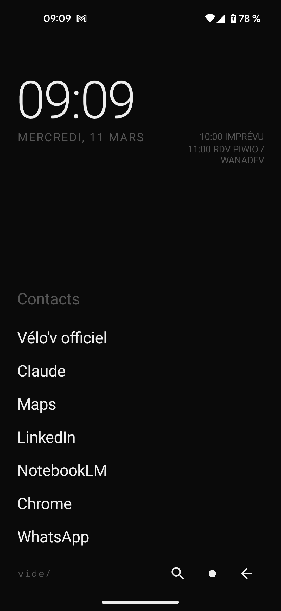
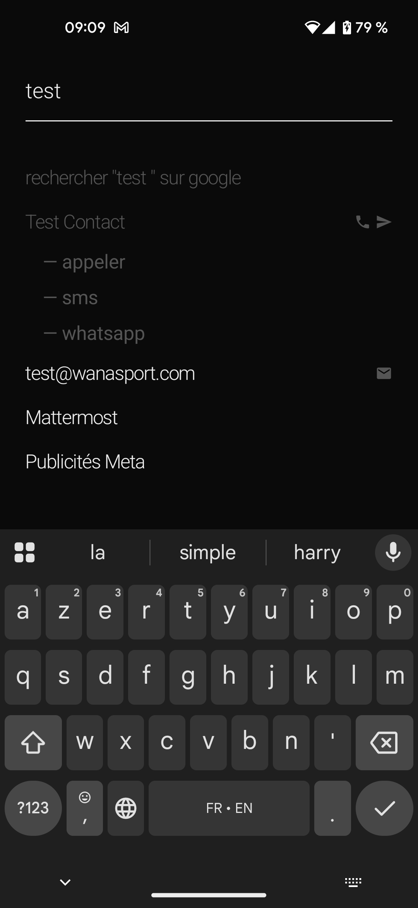
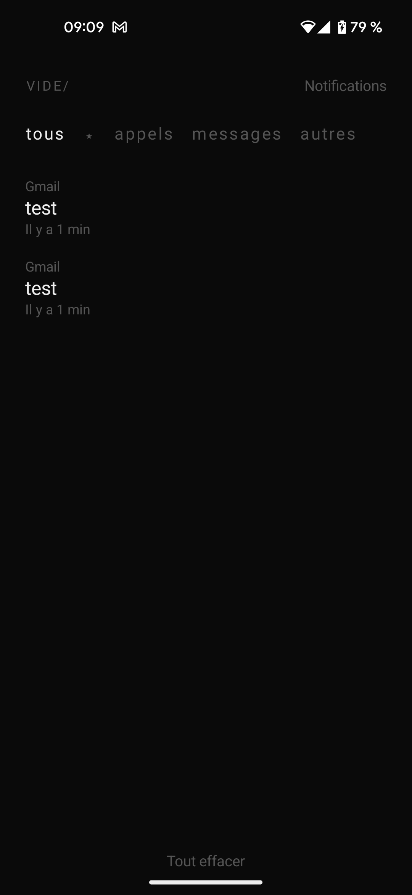

# vide/

A minimal Android launcher designed to make you use your phone less.

<p align="center">
  
  &nbsp;&nbsp;
  
  &nbsp;&nbsp;
  
</p>

## Why

Every launcher is designed to keep you engaged — colorful icons, widgets, feeds, suggestions. **vide/** does the opposite. It strips your home screen down to plain text, removes visual stimulation, and adds just enough friction to make you think twice before opening an app.

No icons. No colors. No animations. Just text on a black screen.

The idea is simple: if your phone feels boring, you'll pick it up less.

## Features

- **Text-only home screen** — your most-used apps as plain text, auto-sorted by frequency
- **Smart search** — find apps, contacts (call, SMS, WhatsApp, email) with fuzzy matching
- **Calendar glance** — upcoming events next to the clock, scrollable, tap to open
- **Notification center** — mark important notifications that survive "clear all", swipe to dismiss, filter by category
- **Zero decoration** — monochrome palette, no icons, no rounded corners, no elevation, no ripple effects

## Design principles

| Rule | Rationale |
|---|---|
| Monochrome only | No visual reward for unlocking |
| No app icons | Removes brand recognition dopamine |
| No animations | Nothing to watch, nothing to wait for |
| Single font (Inter) | Uniform, calm, utilitarian |
| Friction by design | Search to find, text to read, no shortcuts |

## Install

### Try it now

> [**Download latest APK**](https://github.com/come/vide/releases/latest)

### From releases

All versions available on the [Releases page](https://github.com/come/vide/releases).

### Build from source

```bash
git clone https://github.com/come/vide.git
cd vide
./gradlew assembleDebug
```

APK will be at `app/build/outputs/apk/debug/`.

## Permissions

| Permission | Why |
|---|---|
| `QUERY_ALL_PACKAGES` | List installed apps |
| `READ_CONTACTS` | Search contacts from the launcher |
| `READ_CALENDAR` | Show upcoming events on home screen |
| `BIND_NOTIFICATION_LISTENER_SERVICE` | Display and manage notifications |

All permissions are optional — the launcher works without them, just with fewer features.

## Tech

Kotlin · Jetpack Compose · Material3 · MVVM · Min SDK 26 · Target SDK 34

## License

[MIT](LICENSE)
